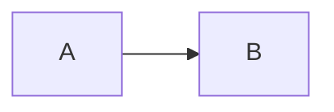

# Markdown features

Syntax handled by the theme's render hooks and Hugo's Goldmark extensions — everything that is _not_ a shortcode. Ordinary Markdown works as expected; this covers what Hextra adds on top.

## Code blocks

The language sets highlighting. An attribute block in braces after it configures the rest:

````markdown
```go {filename="main.go"}
package main
```
````

| Attribute                                   | Effect                                                                                        |
| ------------------------------------------- | --------------------------------------------------------------------------------------------- |
| `filename`                                  | Header bar above the block showing the name, with a file-type icon.                           |
| `base_url`                                  | Turns the filename into a link to `base_url` + `filename`.                                    |
| `lang`                                      | Overrides the fence language for the icon and label.                                          |
| `icon`                                      | Overrides the file-type icon. Takes a name from `icons.md`.                                   |
| `class`                                     | Extra CSS classes on the wrapper.                                                             |
| `linenos`                                   | `table` or `inline`. Line numbers.                                                            |
| `linenostart`                               | First line number. Use when showing an excerpt.                                               |
| `hl_lines`                                  | Highlighted lines, e.g. `[2,"5-7"]`. Counts from the top of the block, not the original file. |
| `anchorlinenos`, `lineanchors`, `hl_inline` | Passed through to Chroma.                                                                     |

Attributes are comma-separated inside one brace block:

````markdown
```python {filename="train.py",linenos=table,hl_lines=[3,"7-9"],linenostart=42}
def train(model, data):
    ...
```
````

A copy button appears on hover by default; `params.highlight.copy` controls it site-wide.

A fence whose language Chroma does not know still renders — it falls back to plain text rather than dropping the attributes.

## Diagrams

Mermaid renders from a plain fence. No shortcode, no configuration:

````markdown

````

The Mermaid script loads only on pages that contain a diagram.

## Alerts

GitHub alert syntax works in blockquotes:

```markdown
> [!NOTE]
> Useful information.

> [!WARNING]
> Something that needs attention.
```

Five types: `NOTE`, `TIP`, `IMPORTANT`, `WARNING`, `CAUTION`. An unrecognised type logs a warning and renders as a plain blockquote.

The `callout` shortcode covers the same ground with more control — custom icons, emoji, and arbitrary Markdown inside. Use alerts for quick notes, `callout` when you need the extra parameters.

## Math

Delimiters, given `math: true` in the page's front matter:

```markdown
Inline: \(E = mc^2\)

Block:

$$
\int_0^\infty e^{-x} \, dx = 1
$$
```

Block math also accepts `\[ ... \]`. Rendering is KaTeX by default; `params.math.engine` switches it.

Without `math: true` the delimiters render as literal text — this is the usual cause of "my equation shows as raw LaTeX".

Requires `markup.goldmark.extensions.passthrough` enabled in `hugo.yaml`; see `site-config.md`.

## Images

Standard syntax, with two extensions. A title produces a caption:

```markdown

```

An attribute block sets HTML attributes directly:

```markdown

```

Paths resolve against the page bundle first, then `assets/`, then `static/`. A leading `/` resolves from the site root; `./` and `../` are relative to the current page.

Lazy loading is on by default (`params.enableImageLazyLoading`). Click-to-zoom is off by default and enabled with `params.imageZoom.enable`, overridable per page.

For galleries and lightboxes, use the `gallery` shortcode instead.

## Headings

Headings get anchor links and feed the table of contents automatically. A class attribute is accepted:

```markdown
## Section title {class="no-step-marker"}
```

`no-step-marker` is the one class the theme acts on: inside a `steps` block it stops a heading from being numbered as a step.

## Links

Local `.md` links are rewritten to clean URLs, so link to source files and let the theme resolve them:

```markdown
[Configuration](configuration.md)
[Getting started](/docs/getting-started.md)
```

Relative links resolve against the current page's directory; `/`-rooted links resolve against the site root and respect a `baseURL` subpath. External `http(s)` links get `target="_blank"` and `rel="noopener"`, plus an arrow icon when `params.externalLinkDecoration` is on.

### Reference-style links

Repeated external URLs are better collected at the end of the file than
inlined at every mention:

```markdown
Hextra's answer is [giscus][giscus], configured at [giscus.app][giscus].

[giscus]: https://giscus.app
[github-discussions]: https://docs.github.com/en/discussions
```

Slugs are kebab-case, definitions go in one block at the very end, and an
unused definition renders nothing. `content/docs/_index.md` is the existing
example.

**They do not work inside a shortcode body.** Link reference definitions are
scoped to the page's own Markdown document, and shortcodes that render their
body through `.Page.RenderString` or `markdownify` — `callout`, `lead`,
`details`, `accordion-item`, `tab` and the rest — parse it in a fresh context
that never sees them. The link silently renders as literal `[text][slug]`.
Inside a shortcode body, write the URL inline.

### One URL, many pages

Neither form helps when the same URL appears across the site and the
destination later moves. For that, put it in a data file and read it with a
shortcode — Hugo substitutes a shortcode placeholder before Markdown parsing,
so a shortcode call works inside a link destination, and unlike a reference
definition it still works inside a shortcode body:

```yaml {filename="data/links.yaml"}
giscus: https://giscus.app
```

```go-html-template {filename="layouts/_shortcodes/link.html"}
{{- index site.Data.links (.Get 0) -}}
```

```markdown
[giscus]()
```

Hugo's built-in `` does the same against `hugo.yaml` site
params. Neither reaches a URL passed as a _parameter_ to another shortcode —
`cta`, `card` and `button` take literal URLs, because shortcode calls are not
parsed inside another shortcode's parameter string.

## Task lists

```markdown
- [x] Done
- [ ] Not done
```

Rendered as checkboxes. Hugo emits them disabled, so they display state rather than accepting clicks; the theme adds an accessible name to each one.

## Raw HTML

Permitted only with `markup.goldmark.renderer.unsafe: true` in `hugo.yaml`. The theme's own home-page layout depends on it, so most Hextra sites have it enabled. Tailwind utility classes in content are prefixed `hx:` — for example `hx:mt-6`.
